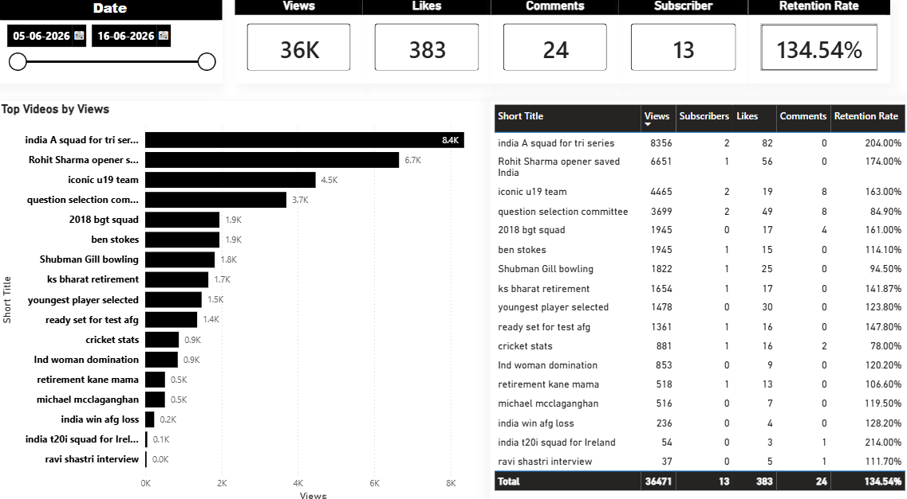

# YouTube Video Performance Dashboard (Power BI)

## 📊 Project Overview
A professional, executive-level Power BI dashboard engineered to analyze video-level engagement, reach, and audience retention metrics. This business intelligence solution transforms raw, multi-row YouTube analytics data into high-impact actionable insights, utilizing a custom dark-accented corporate theme optimized for rapid executive decision-making.

## 🛠️ Key Metrics Developed (KPI Block)
* **Total Views:** Gross viewership tracking across the active timeline (36K cumulative views).
* **Total Likes:** Direct audience appreciation measurement (383 likes).
* **Total Comments:** Direct community conversation and engagement metrics (24 comments)[cite: 1].
* **Subscribers Gained:** Audience growth and channel retention directly tied to content performance (13 subscribers)[cite: 1].
* **Average Retention Rate:** Evaluates audience stickiness and video quality, utilizing an aggregated average across uploads (134.54%)[cite: 1].

## 🎨 Visual & Interactive Architecture
* **Performance Tracking:** A customized horizontal bar chart ("Top Videos by Views") styled with minimalist deep black bars for instant asset performance comparison[cite: 1].
* **Granular Data Grid:** An interactive multi-metric table parsing specific short video titles against views, subscribers, likes, comments, and retention metrics—anchored by a unified high-contrast total row[cite: 1].
* **Dynamic Time Filter:** A responsive Date Slider localized for precise date-range filtering (configured for the 05-06-2026 to 16-06-2026 window)[cite: 1].

## 🔥 Technical Design Achievements
* **Advanced Aggregations:** Corrected standard Power BI aggregation behavior by switching the retention rate logic from a cumulative "Sum" to a weighted "Average" to guarantee mathematical truth[cite: 1].
* **UI/UX Refinement:** Overrode default system text schemas to eliminate cluttered "Sum of" visual titles, resolved typographic inconsistencies, and utilized precise horizontal distribution for perfect visual symmetry[cite: 1].
* **Corporate Theme Engineering:** Departed from standard out-of-the-box software presets to implement a custom corporate palette using black header containers and unified visual borders[cite: 1].

---
*Maintained by [Sohan](https://github.com/analysisbysohan)*
